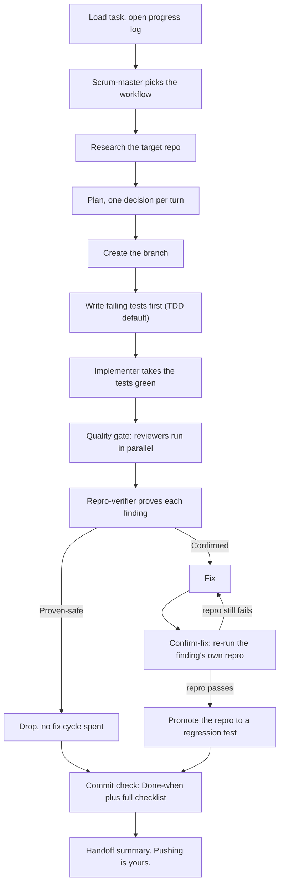

# How adze-bonch works

A plain-language tour of what this plugin does, why each part exists, and what
it will not do for you. Nothing here requires reading the source. If you want
per-agent detail after this, read [`agents-guide.md`](agents-guide.md).

---

## 1. What this is and what it's for

adze-bonch is a Claude Code plugin that turns "Claude, go do this ticket" into a
repeatable procedure with checkpoints, and writes the durable parts of that
procedure down where they survive the end of the chat.

It sits on top of **adze**. Adze is a small local project tracker that Claude
reaches through an MCP server: it stores projects, tasks, and documents on your
machine. Because it is a real store rather than chat history, anything written
there is still readable next week, in a new session, by a different Claude.

The plugin exists to fix three failure modes that show up in real work:

- **Decisions evaporate.** You settle something important in conversation, the
  session ends, and the reasoning is gone. Next session re-litigates it. The
  plugin's answer is to write decisions down at the moment they are made, not
  in a batch at the end.
- **Reviews produce plausible fiction.** A reviewer reads a diff and reports a
  bug. Nobody runs anything. Half the findings are real, half are not, and the
  fix burns a cycle on each. The plugin's answer is that a finding is not real
  until a script has reproduced it.
- **Fixes are declared done without proof.** Somebody edits the code, the test
  suite is green, everyone moves on, and the bug is still there. The plugin's
  answer is that the same script that proved the bug has to be run again and
  pass before the fix counts.

Everything else in the plugin is downstream of those three ideas.

---

## 2. The five commands

### `/adze-bonch:main`

The front door. It loads the discipline document from adze, works out which
adze project you are in (from your message, from the folder name, or by asking),
loads that project's **Pulse** -- a single short document per project saying
where you left off and what the next move is -- and then reads your intent and
routes you onward. Type this at the start of a session when you want Claude
oriented before it does anything. It can also send you straight to PR review or
to listening mode without loading project context at all.

### `/adze-bonch:tackle`

The workhorse. Give it an adze task and it runs that task end to end: research,
plan, branch, tests, code, review, proof, fixes, proof again, regression tests,
commit. It never writes code itself; every writing step is done by a smaller
agent it starts and then checks. Type this when you have a real unit of work
with acceptance criteria and you want it done properly rather than quickly.
Section 3 is entirely about this command.

### `/adze-bonch:status`

A cheap read-only snapshot. It resolves the project, reads the Pulse, and prints
counts of todo / doing / done tasks, blockers, open questions, the last three
documents, and what is next. It is forbidden from writing anything at all. Type
this when you only want to know where you are and do not want Claude touching
the record.

### `/adze-bonch:save`

The "save our work" hammer. It walks back over the last ten to twenty turns of
conversation, picks out the things that look like real decisions (a direction
change, a new playbook, an open question resolved, a tool chosen or rejected, an
approach abandoned), shows them to you as a numbered list, and asks which to
keep. Whatever you accept gets written to adze immediately, and the project's
Pulse is refreshed at the same time. Type this whenever you have just decided
something and do not want to find out later that it lived only in the chat.

### `/adze-bonch:setup`

First-time wizard, safe to re-run. It checks the adze MCP server is reachable
and stops flat if it is not, creates two adze projects ("adze-bonch reference"
and "adze-bonch user profiles"), copies the plugin's `seeds/*.md` files into
adze as live documents, records their hashes in a bootstrap-state document,
creates your user profile, and then offers four optional extras: a voice
template, CLAUDE.md pointer text at safe paths, a session-start reminder hook,
and the edit-blocking check described in section 5. It is idempotent: the
bootstrap-state document is how it knows what already exists.

---

## 3. The main event: what happens to a task, start to finish

This is `/adze-bonch:tackle`. Read it as a sequence. The main assistant runs the
sequence and does the talking; the named agents do the reading, writing, and
judging. Every agent gets its inputs pasted into its instructions in full,
because the agents have no access to adze themselves -- they cannot go fetch a
document by id, so nothing may be passed as a reference.

The whole lifecycle at a glance; each box is a subsection below.

### Loading the task

The main assistant loads the discipline document from adze, resolves which
project you are in, and then resolves the task itself -- by id or title fragment
if you named one, by searching the folder name against open tasks if you did
not, and by asking you if that fails. It reads the task in full: title, body,
acceptance criteria, state, tags.

Then, before anything else happens, it opens a **progress log**: an adze
document tagged `kind:task-log` attached to this task. If one already exists it
is read first, so a session that resumes a half-finished task knows what has
already been done. From here on, one line is appended to that log before every
agent starts and after every step finishes.

*Why this stage exists:* the log is a crash-recovery anchor. If the session dies
mid-run, the next session can read the log and know exactly which step was in
flight rather than guessing or starting over. It is also the paper trail that
makes the final commit checklist checkable against something other than memory.

### Choosing the workflow

A small, fast agent (`scrum-master`) reads the task and returns a short plan:
which of four workflows to run -- **standard**, **lightweight**, **docs-only**,
or **custom** -- plus two independent yes/no flags, `Documentation` and `TDD`.
The workflow choice mainly decides how many reviewers run later. You see the
recommendation and can override any field.

*Why this stage exists:* a one-line config change and a new feature should not
cost the same. Without an explicit routing decision the choice gets made
implicitly and inconsistently, usually in whichever direction is least work.

### Research

An agent (`researcher`) explores the target repository and comes back with a
summary: what the current behavior is, which files are involved, what the call
paths look like, and what approaches are available. Facts about third-party
libraries are looked up in current documentation rather than recalled. The main
assistant, not the researcher, writes that summary into adze as a `kind:research`
document. If such a document is already attached to the task, this step is
skipped and the existing one is read instead.

*Why this stage exists:* planning against a guess about the code produces a plan
that has to be rewritten during implementation. It is also cheaper to read the
repo once, carefully, than to have five later agents each half-read it.

### Planning

Planning stays with the main assistant and is deliberately a conversation, not a
finished document handed over for a yes/no. The rule is one decision per turn:
open questions are listed up front, then worked one at a time, and each one is
put to you with five parts -- what the task asks for, what is actually true with
evidence, the real options and their costs, a recommendation with a stated
confidence level and the thing that would change it, and the specific answer
needed from you.

Two hard constraints ride along:

- **Recommendations are grounded before they are shown.** The target repo's own
  `CLAUDE.md` is read first and always wins; library and vendor facts come from
  current documentation; every claim is labelled as sourced or as inference. You
  asking "are you guessing?" is treated as a process failure, not a question.
  The citations are carried into the plan document so the implementing agent
  never re-derives a settled call.
- **Size is decided here.** The plan defines which files may be touched, that
  set becomes the diff, and nobody downstream is able to shrink it. If the plan
  is heading past roughly ten files, that is said out loud and a split is
  offered. Anything that does not trace to an acceptance criterion is filed as
  its own task rather than riding along.

The output is an ordered list of steps, each naming exact file paths, the change,
and a "done when" condition tight enough for an agent to check on its own, plus
one task-level **"Done when:"** line. The approved plan is written to adze as a
`kind:plan` document. After this point execution goes quiet: only a real signal
interrupts you again.

*Why this stage exists:* everything after it is executed by agents that cannot
ask you follow-up questions. Ambiguity that survives planning becomes a guess
made by an agent with less context than you have.

### Branching

The main assistant creates and checks out a feature branch in the target repo,
named from the task title. If the branch already exists from a previous session
it is reused, with a confirmation first if it carries unpushed commits.

This is also where the language is worked out -- TypeScript, Python, both, or
neither -- so that the matching language-rules file (`reference/typescript-conventions.md`
or `reference/python-conventions.md`) can be pasted into the agents that write
and judge code. Resolving it here rather than later is what gets those rules to
the test writer and the implementer, not just to the reviewers.

*Why this stage exists:* the branch is the smallest unit of "this can be thrown
away". It also fixes the base that every later diff is measured against.

### Tests first

By default the test writer runs **before** any implementation. It writes tests
against the interface the plan describes, with no implementation present, so
they should fail. The main assistant then runs the repo's own verification to
confirm they really do fail. Tests that unexpectedly pass are reported to you
before anything continues, because a test that passes against nothing is testing
nothing.

### Implementation

The `implementer` agent gets the repo path, the branch, the full text of the
relevant plan steps, the acceptance criteria, the resolved conventions, and the
language rules file. It is the only agent that writes implementation code, both
here and later at the fix step. It works inside the file set the plan named, and
if it wants a file outside that set it has to say so rather than just do it.

Afterwards the main assistant runs the repo's verification (lint, typecheck,
tests, whatever the repo's `CLAUDE.md` defines). On failure the same agent is
started again with the failure output pasted in. Three attempts per failure,
then it stops and asks you. There is also a soft ceiling of roughly eight fix
attempts across implementation, tests, and later fixes combined: past that, a
task usually has a plan problem rather than a code problem, and the run stops
for a rethink.

### The group of reviewers

This step is mandatory and never skipped, not even for a one-line change.

First the diff is captured, and how it is captured matters. The base is resolved
against the remote branch, not the local one: a local base branch is routinely
behind its remote, and using it would silently hand the reviewers a larger diff
than the change is, showing them other people's committed code as if it were
newly written. Renames are kept as renames so a moved file does not read as a
deletion plus a suspicious new file.

Then reviewers run at the same time, each one reading the full diff pasted into
its instructions. On a standard workflow there are seven:

- **code-reviewer** -- the changed files against the repo's own conventions.
- **acceptance-qa** -- does this actually meet the task's acceptance criteria.
- **edge-case-qa** -- boundaries, empty and null inputs, error paths, races.
- **code-smells-reviewer** -- design and maintainability problems that are not bugs.
- **test-reviewer** -- test quality: hollow assertions, over-mocking, bloat.
- **self-containment-reviewer** -- does anything committed leak private context,
  local scratch paths, internal shorthand, or session-only references.
- **comment-claim-verifier** -- takes every falsifiable claim in changed comments
  and docstrings and checks it against the code by tracing what it refers to.

Lightweight runs four or five of these, docs-only runs three, custom runs
whatever the routing agent specified. Findings are then merged, deduplicated by
file and line, keeping the higher severity when two reviewers hit the same spot.
Per-agent detail is in [`agents-guide.md`](agents-guide.md).

*Why this stage exists as a group rather than one reviewer:* these are different
reading modes, and one agent asked to do all seven does none of them well. They
run at the same time because they do not depend on each other.

### Proving the findings by running code

Now the important part. Every finding goes to the `repro-verifier`, which is
read-only over your code but has a durable scratch directory of its own, outside
the repo, that survives sessions and reboots, because the script written there
may need to run again later from a different session.

For each finding it writes and runs a reproduction script and returns one of
three verdicts:

- **Confirmed** -- the script reproduced the problem against the actual code. Fix it.
- **Proven-safe** -- the claim does not hold, and here is the evidence that
  disproves it. Drop it. Do not spend a fix cycle on it.
- **Inconclusive** -- could not be settled either way. You are told, and you
  decide whether to fix it anyway.

If the optional `adze-gate` tool is installed it does not take the verdict on
faith: it executes the script itself rather than trusting the report, requiring
a Confirmed finding's script to exit non-zero and a Proven-safe one to exit zero.

It also runs the target repo's own checks. If it reports that it could not run
something, that is the main assistant's problem to clear, not a reason to skip:
regenerate the ignored build directories, supply the `.env` the suite reads,
start the containers, check out the commit under test. Only if the code
genuinely cannot be run after all that does the run stop and tell you.

*Why this stage exists:* static review produces confident text whether or not
the bug is real. Without execution there is no way to tell a real finding from a
well-written guess, and both cost the same to "fix".

### Fixing

The same `implementer` agent that wrote the code is started again in fix mode,
with the findings and their verdicts pasted in, including any you explicitly
deferred, marked as do-not-fix. Proven-safe findings are dropped rather than
fixed. Verification runs again afterwards.

That verification does **not** confirm any finding. The suite was already green
while the defect existed -- that is precisely why the finding needed a
reproduction script in the first place.

### Proving the fix

Also mandatory, also never skipped. For every finding that was Confirmed, the
`repro-verifier` runs **that finding's own script again** against the fixed
code, and it must now pass. The earlier step proved the defect by making a
script fail; this step closes the loop with the same script. A red that is never
taken green is half a test.

Rules attached to this step:

- A green repo test suite is not a substitute. Those tests did not catch the
  defect, so their passing says nothing about it.
- A fix whose script still fails is not a fix. It goes back to the fix step with
  the script's output attached. No rewording, no arguing from the code that it
  ought to work now. It counts against the fix-attempt budget.
- A finding whose script was never re-run does not reach the commit check.
- If the script is missing or no longer runnable, it is rewritten and re-run,
  never waived. The directory is durable, so a missing script is a genuine
  anomaly and is reported as one.

The same step also does a **reachability count**. Re-running the script proves
the fix works on the one path the script walked. It does not prove the behavior
is gone everywhere. So for each Confirmed finding the verifier lists every other
route that reaches the same behavior -- other callers, sibling branches, other
call sites -- and marks each one COVERED or NOT COVERED. This is written as an
enumeration on purpose: "list every path and mark each" fails loudly when
skipped, in a way that "does this fix look complete?" never does.

A NOT COVERED path does not flip the finding's result, but it does mean the step
is not finished. Each one is shown to you by call site and needs a decision:
fix it now (back to the fix step, then back here again), or accept the risk in
your own words with the reason recorded. A NOT COVERED path with no recorded
decision is never a valid ending. A finding with no other paths at all is fine,
but only when the verifier says so explicitly and shows the search that supports
it.

### Turning proven bugs into permanent tests

A reproduction script is evidence, not a guard. It lives in a scratch directory
outside your repo, and once the run ends nothing stops the same defect coming
back unnoticed -- the repo's suite was green while the bug existed.

So every Confirmed-and-fixed finding gets an explicit promote-or-decline
decision. The test writer, in promote mode, translates the script into a
permanent regression test in your repo. The mechanics that matter:

- **The trigger carries over exactly.** The precise input or call sequence that
  provoked the bug is preserved faithfully.
- **The assertion is rewritten.** As a script its job was to fail against broken
  code; as a test its job is to pass against fixed code and fail again only if
  the bug returns. It is a new assertion written from the finding and the fix,
  not the old one negated.
- **The trigger is never weakened to make the test pass.** A test that only goes
  green after its input was softened passes for an unrelated reason.
- **It is verified in both directions.** The new test passes against the fixed
  code, and the same test, unmodified, fails when the fix is temporarily stashed
  away -- proving it would actually have caught the regression. If a fix cannot
  be cleanly isolated for that stash, the test writer says so outright and cites
  the original script's failure as the nearest available evidence.

Declining is a legitimate outcome: scripts that need live infrastructure, that
depend on timing or a race, or that measure performance do not belong in a unit
suite and would erode trust in it. What is not allowed is skipping the decision
silently, because a silent skip reads exactly like "there was nothing to
promote".

### The commit check

Before anything is committed you are shown a checklist, and every line must be
true:

- the reviewers ran and every one returned a real result, not an empty or
  truncated one;
- the reproduction step ran and returned verdicts;
- findings were fixed or explicitly deferred;
- every Confirmed finding's own script was re-run and now passes;
- reachability was enumerated and every NOT COVERED path has a recorded decision;
- every Confirmed-and-fixed finding was promoted or declined with a reason;
- verification passed after the last change;
- all plan steps are implemented;
- the task-level "Done when:" condition is met;
- no `[GOVERNANCE]` items are left unaddressed.

Two lines carry an explicit warning: if you are about to tick them from memory
rather than from a report you actually received, they did not happen.

Once you confirm, files are staged **by name** -- never `git add -A` -- and
committed with a conventional-commit message. The plugin never pushes. That is
yours.

### Handoff

Finally you get a summary: branch, commit hash, files changed, tests added,
finding counts, verification state. The run ends at the summary; pushing and
pull request review are yours, and adze-bonch does not review pull requests
itself.

---

## 4. The four flag words

Agents cannot ask you questions. So they emit literal tokens in their output,
and the main assistant scans for these after **every** agent returns, before
continuing.

**`[GOVERNANCE]`** -- the agent noticed a change to the plan, scope, or timeline
that you did not sanction this session. A dependency appeared that moves the
date; a research finding made part of the plan pointless; a new acceptance
criterion emerged that was not in the task. It is always shown to you and never
auto-decided, and a `kind:governance` task is created recording it even if you
dismiss it, so the record exists later. The current step does not continue until
you acknowledge.

**`[PLAN-TEST-CONFLICT]`** -- the implementer has a failing test it cannot make
pass without violating the written plan. The plan says do not touch module Y and
the test asserts behavior that lives in Y; or the test asserts a shape the plan
says should be different. The agent must present the test, what it asserts, the
conflicting plan clause quoted, and both ways out (amend the plan, amend the
test) with a recommendation. Everything halts. No more code changes until you
resolve it. This exists to stop the obvious shortcut: quietly hacking whichever
of the two is easier to bend.

**`[SCOPE-EXPANSION]`** -- the implementer wants to touch a file the plan did not
list. It must state the planned file set, the proposed addition and why, the
smallest change that would avoid it, and what breaks if it is refused. This
needs your explicit approval before the agent continues. If you approve, the
plan is updated so later reviewers know the wider set was sanctioned; if you
refuse, the agent either finds a smaller change inside the original set or hands
the expansion off as a new task. This exists because "while I was in there"
edits inflate diffs and hide real changes among incidental ones.

**`[UNVERIFIED]`** -- the agent is about to state something as fact that it has
not checked against a source this session. This one has a sharp edge: it is not
a license to guess with a label attached. If a search, a file read, a `--version`
call, or an adze lookup would settle it in under a minute, the agent is required
to go get it and answer from the source instead. Emitting the token when a
source was reachable is itself a failure. The mandatory triggers are worth
knowing, because they are counter-intuitive: an unfamiliar proper noun (not
recognizing it *is* the signal), a version you cannot place or that postdates
your training, a claim assembled from circumstantial evidence rather than read
from a source (four consistent clues are still zero sources), and any exact
number, limit, filename, or parameter name recalled rather than read. Unlike the
other three, this one does not halt anything -- but it must be shown to you in
the **same** response that carries the claim, never as a caveat added after you
have already read the claim as fact.

The failure this guards against is not missing information but not noticing that
information needs fetching: assembling several consistent circumstantial clues
into a confident, wrong answer when a single lookup would have settled it.

---

## 5. What it will not do for you

**The edit-blocking check only sees the main session's own edits.** The optional
`gate-check.sh` hook blocks `Edit`, `Write`, `MultiEdit`, and `NotebookEdit` in
the session it is registered for while findings are unverified. It does not
constrain a sub-agent's tool calls at all, and it does not see anything done
through a shell command -- a `sed -i` or a heredoc write sails straight past it.
It is a discipline aid for the main driver. It is not a sandbox and cannot be
used as one.

**It also fails open on purpose.** Missing `jq`, malformed state, or any
unexpected error lets the edit through. It must never be the reason ordinary
editing gets stuck. Same for its file locking: if `flock` is not available
(notably on stock macOS) or the lock cannot be taken within two seconds, it
proceeds without the lock rather than hang.

**The enforcement tooling is opt-in and defaults to off.** `adze-gate` and its
hook are installed only if you opt in during setup, which defaults to off.
When it is absent, the verification steps are still mandatory -- they are just
not mechanically blocking anything while they happen. The tool is the
enforcement of the discipline, not the discipline.

**Everything depends on adze being set up.** No reachable MCP server and setup
stops at step one. No discipline document and `/adze-bonch:main` halts and tells
you to run setup. No resolvable project and status prints nothing useful. And
`/adze-bonch:tackle` needs an actual adze task to work on: if it cannot resolve
one from your message or the folder name, it asks and stops. This is a plugin
for tracked work, not for ad-hoc requests.

**There is no isolated copy of your repo.** Every step works directly in your
real working tree on your real branch, because a copy built from the last commit
would not be able to see the previous step's uncommitted work. So a run that
goes wrong leaves its partial edits sitting in your tree. The plugin will not
clean that up on its own: it shows you the diff for the affected files and waits
for your confirmation, then restores file by file. It is explicitly not
authorized to reach for `git reset --hard` or `git clean -f`.

**It never pushes, and it does not review pull requests.** Commit is the last
thing it does. Pushing is yours, and pull request review is yours.

**Several flows are not built.** Brainstorm, refine, and verify are named in the
routing table and are not shipped; for a new project you call adze directly. The
`Documentation` flag is recorded for routing but does not start a documentation
agent in this build -- docs are handled inline by the implementer and during
plan steps.

**Some checks depend on the assistant being honest with itself.** The commit
checklist is prose, not a program. When the enforcement tool is not installed,
nothing mechanically stops a line being ticked from memory. The source pushes
back on this in the only way text can, by saying so on the checklist itself, but
it is worth knowing where the real boundary is.

**Reviewers judge; they do not run.** Six of the seven cannot execute anything.
Only the reproduction verifier runs code, and only after the reviewers are done.
A finding that only execution can settle is marked as such and handed onward,
not resolved by reading.

**One Pulse per project, or it stops.** If more than one `kind:pulse` document is
attached to a project, `/adze-bonch:main` and `/adze-bonch:status` halt and ask
which is authoritative rather than picking. The Pulse also has a hard size
budget of about 25 lines; if it is over, you get a warning telling you to re-trim
it, and the overflow is meant to become tasks rather than more Pulse.

**Agents cannot look anything up for themselves.** They have no adze access.
Everything they need has to be pasted into their instructions in full: the plan
steps, the task text, the diff, the function bodies the diff only shows
partially. If the diff is large it is split by file and reviewed in chunks. A
step that passes a document id instead of its contents is a bug, not a shortcut.

---

## 6. Where the rules actually live

Two places, and the split is the point.

**In the plugin, on disk:** the fixed machinery. The command procedures, the
agent definitions, the language rules files and prompt templates, the
enforcement scripts, and the seed copies of the shared documents. This is what
changes when the plugin is updated.

**In adze, as live documents:** the discipline text. The discipline document,
the named protocols, the workflow description, the branch-naming and
progress-log and Pulse formats, the default voice. These are the copies setup
made from the plugin's seeds, and they are what the commands actually read at
runtime. Alongside them: your user profile, each project's `workflow_overrides`
block, and every task's own research, plan, progress log, and Pulse.

That split is why editing one file may change nothing. Editing the plugin's
copy does not change how anything behaves, because the commands load the adze
document, not the file, and the plugin file only reaches adze when setup runs
again. Editing the adze document, by contrast, changes behavior immediately and
permanently for you and changes nothing in the plugin. That is deliberate: to
evolve the discipline live, edit the adze document, not the plugin repo.

The same split explains settings. Any workflow setting is resolved through a
chain, first hit wins: what you said in this message, then the project's
`workflow_overrides` block, then your user profile, then the canonical default.
Three of those four live in adze.
